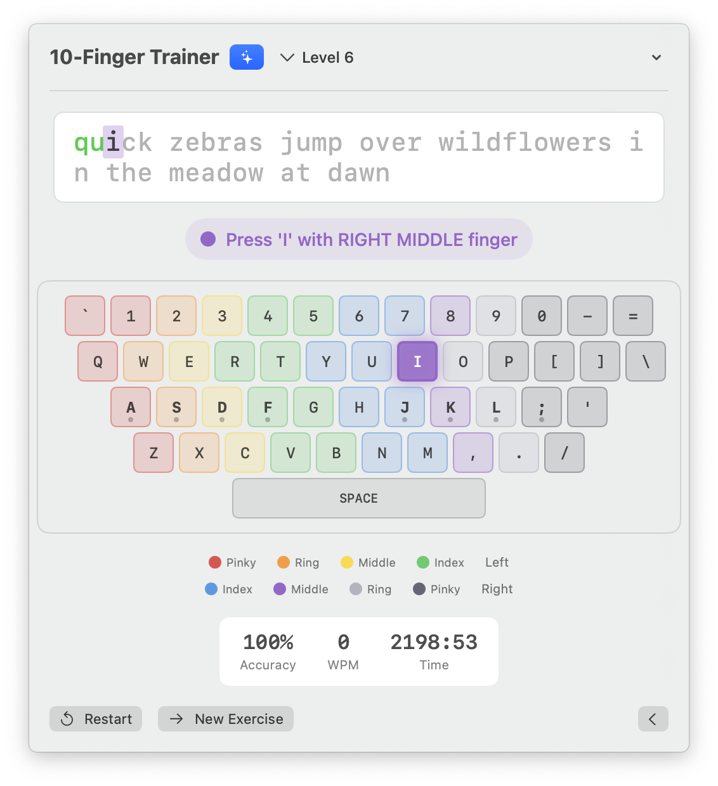

# Ten Finger Typing

A macOS menu bar app for learning proper touch typing technique with AI-powered exercises.

<p align="center">
  
</p>

## Features

- **Menu Bar Integration** - Lives in your menu bar for quick access anytime
- **Progressive Lessons** - Start with home row keys and gradually add more as you improve
- **Visual Keyboard** - On-screen keyboard shows which finger to use for each key
- **AI-Generated Exercises** - Uses Claude API to create fresh, contextual typing exercises
- **Real-time Feedback** - See correct/incorrect characters as you type
- **Performance Tracking** - Monitors accuracy and words per minute

## Requirements

- macOS 13.0+
- Xcode 15.0+
- Optional: Anthropic API key for AI-generated exercises

## Installation

### Prerequisites
- macOS 13.0 (Ventura) or later
- Xcode 15.0 or later (download from [Mac App Store](https://apps.apple.com/app/xcode/id497799835))

### Steps

1. **Clone the repository**
   ```bash
   git clone https://github.com/patrickfreyer/TenFingerTyping.git
   cd TenFingerTyping
   ```

2. **Open in Xcode**
   ```bash
   open TenFingerTyping.xcodeproj
   ```

3. **Build and run**
   - Press `Cmd + R` in Xcode, or
   - From command line:
     ```bash
     xcodebuild -scheme TenFingerTyping -destination 'platform=macOS' build
     ```

4. **Grant permissions**
   - The app may request accessibility permissions to capture keystrokes
   - Go to System Settings → Privacy & Security → Accessibility if prompted

The app will appear as a keyboard icon in your menu bar.

## Configuration

### AI Exercises (Optional)

To enable AI-generated typing exercises, set your Anthropic API key:

**Option 1: Environment Variable**
```bash
export ANTHROPIC_API_KEY="your-api-key"
```

**Option 2: UserDefaults**
The app also checks `UserDefaults` for the key `anthropic_api_key`.

If no API key is configured, the app falls back to built-in exercises.

## Usage

1. Click the keyboard icon in the menu bar
2. Start typing the displayed exercise
3. The virtual keyboard highlights which finger to use
4. Complete exercises to track your progress
5. Advance through levels to learn new keys

## Lesson Structure

- **Level 1**: Home row basics (a, s, d, f, j, k, l)
- **Level 2**: Top row introduction
- **Level 3**: Bottom row
- **Level 4+**: Full keyboard with punctuation

## Project Structure

```
TenFingerTyping/
├── TenFingerTypingApp.swift   # App entry point
├── Models/
│   ├── FingerMap.swift        # Key-to-finger mapping
│   ├── Lesson.swift           # Lesson definitions
│   └── TypingSession.swift    # Session state tracking
├── Services/
│   └── ClaudeAPIService.swift # AI exercise generation
├── ViewModels/
│   └── TypingViewModel.swift  # Main view model
└── Views/
    ├── ContentView.swift      # Main container view
    ├── KeyboardView.swift     # Virtual keyboard
    ├── KeyView.swift          # Individual key component
    └── TypingPromptView.swift # Exercise display
```

## License

MIT
